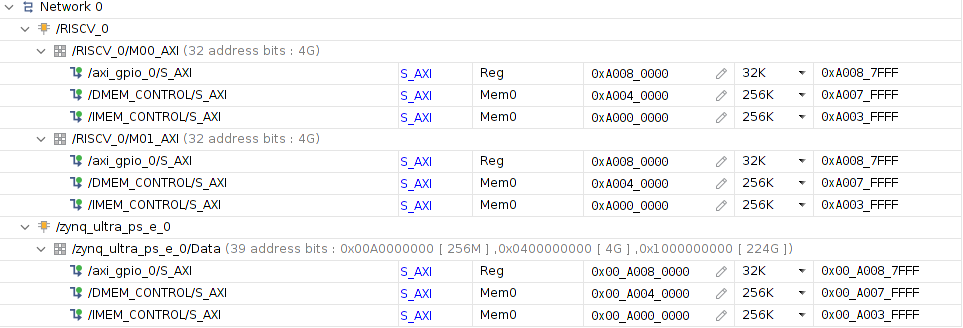

# AI-Edge 5

## Overview

This repository contains my submission to [SIGNATE 5th AI Edge contest][1]. This submission uses a `yolov4-tiny` implementation from [AlexeyAB darknet][2] with [SORT][12] tracking algorithm. After training with `yolov4-tiny` using the AI Edge 5 dataset, The model is further processed based on the steps from [Yolov4 Vitis AI Tutorial][3]. With [keras-YOLOv3-model-set][11], `yolov4-tiny` configuration and weights are converted to Keras `.h5` and from `.h5` to TensorFlow `.pb`. The `.pb` model was processed further to `.xmodel` with Vitis AI workflow. [DPU-PYNQ][10] was used to control yolov4-tiny `.xmodel` in Xilinx Ultra96v2 board. After the inference, the `yolov4-tiny` bounding boxes were tracked using SORT algorithm.

SORT consists of two main algorithms: the Kalman filter and Hungarian algorithm. In this case, [SIGNATE RISC-V][4] was chosen as a soft RISC-V core to perform the computation for Hungarian algorithm. SIGNATE RISC-V is based on [VexRiscv][5] RV32IM. This core was used with RISC-V assembly to perform computation. To communicate between SIGNATE RISC-V core and Python programming language, the RISC-V core was controlled using [PYNQ][9].

For more information, please look at `./reports/report.md` or `./reports/report.pdf`.

## Requirements

### Programs:

```
# For local pc.
Ubuntu 18.04.6 LTS
Vitis AI == 1.4.0
Vivado == 2020.2
riscv-gnu-toolchain

# For remote Ultra96v2 board.
PYNQ == 2.6.0
DPU-PYNQ == 1.4.0
```

## Prepare and train DarkNet

Firstly, clone the repository with submodules and navigate to the directory.

```bash
git clone --recurse-submodules https://github.com/ninfueng/aiedge5
cd aiedge5
```

Put all training videos in `./dataset/train_videos` and test videos in `./dataset/test_videos`.
Also put all training annotations in `./dataset/train_annotions`.

Converts all training videos and test videos to `.jpg` images via the command:

```bash
python prepare_dataset.py
```

The training images were split into 80:20 training and validation datasets and listed in `./dataset/train.txt` and `./dataset/test.txt`.

To train `yolov4-tiny`, please follow the steps to build binary files from the darknet repository. You can use generated `./dataset/train.txt` and `./dataset/test.txt` with files in `./darknet_file` to train the `yolov4-tiny` model. Note that this process requires the pre-trained weights [yolov4-tiny.conv.29][6], and you may require to change the paths inside the files in `./darknet_file`. The example of the command is as follows:

```bash
./darknet detector train aiedge5.data yolov4-tiny-512.cfg yolov4-tiny.conv.29 -map
```

Note if you have more than one GPU, you can added `--gpus` to use multi-gpus. For example, `--gpus 0,1`.

## Compile with Vitis AI

Please follow the [Vitis AI][7] getting started guide to build the Vitis-AI docker image with GPU support.
The scripts in `./vitis_ai_files` are used to convert the `yolov4-tiny` weights and configuration to `.xmodel`.
Note that you may require to change the path of files in `./vitis_ai_files.` Please read `./vitis_ai_files/README.md` for more details in this Vitis AI step.

## Generate RISC-V bitstream

Download SIGNATE RISC-V Vivado project `Vivado.zip` from this [Google drive link][4]. Increase the `IMEM` and `DMEM` memory with the address editor, following the figure below. After that, please generate the bitstream of this FPGA design with Vivado 2020.2.



## Generate RISC-V assembly code

[riscv-gnu-toolchain][8] is required to convert C code into assembly code. Please move to the suitable directory to `git clone` and follow these build steps below:

```bash
git clone --recursive https://github.com/riscv-collab/riscv-gnu-toolchain
# `a` must be used. Otherwise, this cannot be config-able.
./configure --prefix=/opt/riscv --with-arch=rv32ima
sudo make linux
sudo make install
```

After that, you should be able to build the hexadecimal format assembly code with the command:

```bash
make compile_c
```

You can find the hexadecimal format of the assembly code at `./Hungarian-Algorithm-in-C-Language/main.hex` and a readable format at `./Hungarian-Algorithm-in-C-Language/main2.hex`. The `main.hex` will be used in the next section.

## Deploy to Ultra96v2

[PYNQ][9] image was used as the base environment for Ultra96v2. Use an image burner software such as `balenaEtcher` to burn the PYNQ image into your sd-card. Then, connect mini-USB to the USB port of the Ultra96v2 and use a serial communication program such as `gtkterm`. To communicate with the board, set the `Baud Rate: 115200`. Then, install [DPU-PYNQ][10] to Ultra96v2.

Necessary files to run this submission in Ultra96v2 are in `./deploy` folder. Please move them and `./Hungarian-Algorithm-in-C-Language/main.hex` into `/home/xilinx/jupyter_notebooks` in Ultra96v2 environment and `cd` to that location.

Root user is required to use both `PYNQ` and `DPU-PYNQ` modules.
This can be done using the command below:

```bash
# Enter password: xilinx
su
```

The deployment code is separated into two stages: `stage1.py` and `stage2.py`.

```bash
python3 stage1.py
python3 stage2.py
```

If there are any `Segmentation error` during the execution of `stage2.py`, please restart the board and re-run again as below:

```bash
python3 stage2.py
```

After executing `stage2.py`, `submission.json` should be generated, which can be submitted to SIGNATE leader board.

[1]: https://signate.jp/competitions/537
[2]: https://github.com/AlexeyAB/darknet
[3]: https://github.com/Xilinx/Vitis-AI-Tutorials/tree/master/Design_Tutorials/07-yolov4-tutorial
[4]: https://drive.google.com/drive/folders/10-Iuoyv82enzYSUc1rQC-JeBsagdHbnd
[5]: https://github.com/SpinalHDL/VexRiscv
[6]: https://github.com/AlexeyAB/darknet/releases/download/darknet_yolo_v4_pre/yolov4-tiny.conv.29
[7]: https://github.com/Xilinx/Vitis-AI
[8]: https://github.com/riscv-collab/riscv-gnu-toolchain.git
[9]: https://github.com/Xilinx/PYNQ
[10]: https://github.com/Xilinx/DPU-PYNQ
[11]: https://github.com/david8862/keras-YOLOv3-model-set
[12]: https://github.com/abewley/sort

## Acknowledgement

* [sort](https://github.com/abewley/sort)
* [Hungarian-Algorithm-in-C-Language](https://github.com/mohammadusman/Hungarian-Algorithm-in-C-Language)
* [Alexey DarkNet](https://github.com/AlexeyAB/darknet)
* [Vitis AI Tutorials](https://github.com/Xilinx/Vitis-AI-Tutorials)
* [SIGNATE RISCV](https://drive.google.com/drive/folders/10-Iuoyv82enzYSUc1rQC-JeBsagdHbnd)
* [VexRiscv](https://github.com/SpinalHDL/VexRiscv)
* [Vitis AI](https://github.com/Xilinx/Vitis-AI)
* [riscv-gnu-toolchain](https://github.com/riscv-collab/riscv-gnu-toolchain.git)
* [PYNQ](https://github.com/Xilinx/PYNQ)
* [DPU-PYNQ](https://github.com/Xilinx/DPU-PYNQ)
* [keras-YOLOv3-model-set](https://github.com/david8862/keras-YOLOv3-model-set)

## License

MIT, however, may differ for third-party repositories or files in `./Hungarian-Algorithm-in-C-Language`, `./deploy/sort`, and `./vitis_ai_files/utils.py`.
