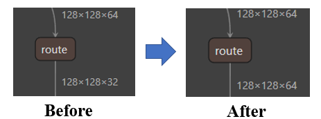
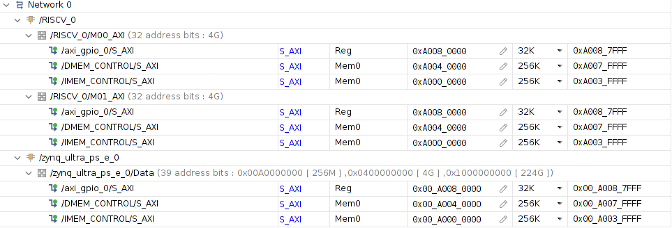

# AI-Edge 5 Report

## Overview

This report describes my submission to **[SIGNATE 5th AI Edge contest][1]**. Overall, the task in this contest is object tracking, with at least one of the object tracking operations must be performed with RISC-V core. Object tracking can be simplified into object detection and bounding box tracking tasks. Therefore, object tracking can be performed using object detector model and tracking algorithm.

The overview of this submission is shown in the figure below. This submission chooses `yolov4-tiny` implementation from **[AlexeyAB darknet][2]** with **[SORT][3]** tracking algorithm. After training with `yolov4-tiny` using AI Edge 5 dataset, The model was further processed based on the steps from **[Yolov4 Vitis AI Tutorial][4]**. With **[keras-YOLOv3-model-set][5]**, `yolov4-tiny` configuration and weights are converted to Keras `.h5` and from `.h5` to TensorFlow `.pb`. The `.pb` model was processed further to `.xmodel` with Vitis AI workflow. **[DPU-PYNQ][6]** is used to control yolov4-tiny `.xmodel` in Xilinx Ultra96v2 board. After the inference, the `yolov4-tiny` bounding boxes were tracked using SORT algorithm.

{height=50%}

SORT consists of two main algorithms: the Kalman filter and Hungarian algorithm. In this submission, **[SIGNATE RISC-V][7]** was chosen as a soft RISC-V core to perform the computation for Hungarian algorithm. SIGNATE RISC-V is based on **[VexRiscv][8]** RV32IM. This core was used with RISC-V assembly to perform computation. To communicate between the SIGNATE RISC-V core with Python programming language, the RISC-V core was controlled using **[PYNQ][10]**.


### Darknet setting

There is a new feature in `yolov4-tiny`: a route and split operation which splits feature map channels into two groups and selects only one of these groups to process further. The operation is visualized in the figure below. However, Vitis AI 1.4 does not support this split operation. Therefore, I replaced these operations with a standard route without a split operation.

{height=25%}

The training dataset was split into training and validation datasets with the radio of 80:20.

The original `yolov4-tiny` anchor boxes are replaced with anchor boxes optimized for AI Edge 5 dataset.
This anchor box optimization was done via the following command:

```bash
./darknet detector calc_anchors aiedge5.data -num_of_clusters 6 -width 512 -height 512
```

The original anchor boxes are `[10,14], [23,27], [37,58], [81,82], [135,169], [344,319]`. Each one of `[]` indicates the anchor box's width and height. The optimized ones are `[5,14], [9,30], [27,29], [16,64], [49,68], [100,117]`. This may indicates that the smaller anchor boxes are more suitable for AI Edge 5 dataset.


### RISC-V and Hungarian Algorithm

I selected the Hungarian algorithm to perform with the RISC-V RV32IM core because it can be converted into all integer operations easier than others. I used Hungarian C code based on **[Hungarian-Algorithm-in-C-Language][9]** as the template code for this algorithm. To convert Hungarian algorithm to integer, the input cost matrix (IOU) should be converted into integers first. Since this C Hungarian algorithm was created to optimize in the minimum direction, I have to change the optimization direction to maximum (the higher IOU, the better). Given the IOU cost in range of $[0, 1]$, I used this equation $cost_{new} = round((1 - cost) \times 1000)$ to convert from the floating-point to integer and inverse the optimization direction.

The RISC-V RV32IM core that I used was provided by SIGNATE with minor modifications. I have only increased both `DMEM` (data memory) and `IMEM` (instruction memory) memory range to 256KB to earn more space for assembly codes and data. Based on this RISC-V core, I modified this Hungarian C code instead of receiving the inputs from `stdin` to receive the inputs from `DMEM` rather. The outputs of Hungarian code were also modified from produce outputs to `stdout` to produce the outputs to `DMEM` memory instead.

RISC-V core can be controlled using `PYNQ`. However, there are several limitations for `PYNQ,` and `DPU-PYNQ`. Both can not be used in the same Python program; therefore, I need to separate the code into `stage1.py` and `stage2.py`. A bug forced me to reboot the board after I run `stage1.py`. Otherwise, I may get the `Segmentation fault error` when I run `stage2.py`.

`stage1.py` is a script for `yolov4-tiny` DPU inference, non-max suppression, and others. All resultant bounding boxes from `stage1.py` are saved to `detection_list.npy`. `stage2.py` is a script that loads `detection_list.npy`, processes with SORT algorithm, and generates the `submission.json`, which can be submitted to SIGNATE to score.

Another issue is FPGA environment is different from the personal computer environment. After increasing the memory address of the FPGA, the valid FPGA memory address is only within $[A0000000, A007FFFF]$ as shown in the figure below. To allocate the 32-bit into the stack, the compiler may use `addi sp, sp, -4`. However, assuming that `sp` starts with all zeros, then the `sp` will become $FFFFFFFC$, which exceeds the valid FPGA memory range. To overcome this problem, I found the solution to initialize the stack pointer first with `lui (load upper immediate) sp, sp, A0030`.



Since the `IMEM` address starts with $A0000000$ instead of $00000000$, the compiler requires to acknowledge the `IMEM` address range. Otherwise, it may generate the wrong address for the jump or branch operations. This can be adjusted during the linking process. The `.ld` file as shown below can be used to indicate the address range in this case.

```ld
MEMORY
{
    IMEM (rxw): ORIGIN = 0xA0000000, LENGTH = 0x40000
}
```

### Results

The `stage1.py` consumes (measure with `time python3 stage1.py`):
```
real    26m17.523s
user    30m14.733s
sys     0m42.996s
```

The `stage2.py` consumes (measure with `time python3 stage2.py`):
```
real    4m20.862s
user    3m33.671s
sys     0m19.770s
```

In terms of tracking performance, I scored `0.2579209` on the SIGNATE leaderboard, as shown in the figure below. I observed no difference after using with RISC-V Hungarian algorithm.


Using `real` time, both `stage1.py` and `stage2.py` consume 31 minutes with 38 seconds, or 1898 seconds. Or around 5.85 frames per second or 25.65 seconds per test video. Note that if the reboot time after I run `stage1.py` is counted, the time usage will be longer.

Unknowingly, this RISC-V assembly code can operate only with the `2x2` cost matrix in Ultra96v2. C code works fine on the personal computer settings. Therefore, I was forced to use the RISC-V core to perform the Hungarian algorithm only when the input cost matrix is `2x2`. These `2x2` cost matrices are produced from `yolov4-tiny` total 123 frames out of 11,100 total frames. Out of these 123 frames, I used the ARM processor to perform the Hungarian algorithm instead.


[1]: https://signate.jp/competitions/537
[2]: https://github.com/AlexeyAB/darknet
[3]: https://github.com/abewley/sort
[4]: https://github.com/Xilinx/Vitis-AI-Tutorials/tree/master/Design_Tutorials/07-yolov4-tutorial
[5]: https://github.com/david8862/keras-YOLOv3-model-set
[6]: https://github.com/Xilinx/DPU-PYNQ
[7]: https://drive.google.com/drive/folders/10-Iuoyv82enzYSUc1rQC-JeBsagdHbnd
[8]: https://github.com/SpinalHDL/VexRiscv
[9]: https://github.com/mohammadusman/Hungarian-Algorithm-in-C-Language
[10]: https://github.com/Xilinx/PYNQ
